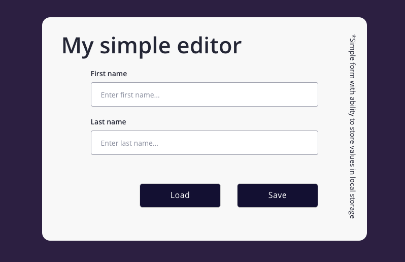
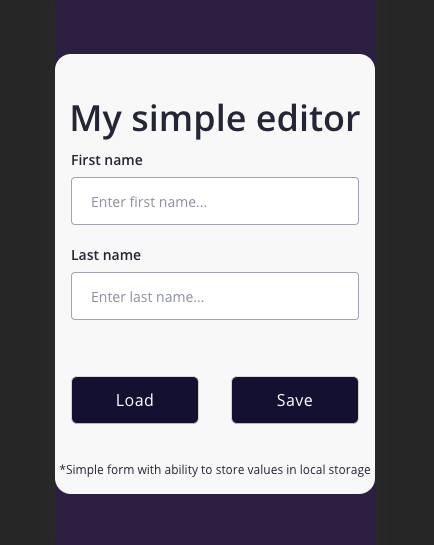

# Simple editor with 2 fields - localstorage playground

Here is working website - feel free to test it: [Simple editor website](http://jundymek.github.io/simple-editor)

This is homework from [WTF](https://cotenfrontend.pl) frontend course.

Form simply gets data from user and stores it in localstorage (save button)
After hitting load button application shows data stored in localstorage in input fields.

Tehnologies and tools used in this project:
- HTML5
- CSS3
    - flexbox 
    - grid
    - media queries
    - sass (scss syntax)
- JS ES6
- Visual Studio Code
- Figma (layout design)
- GULP
- GIT
- Node.js / NPM

and of course it is made fully responsive, Here is mobile look:

